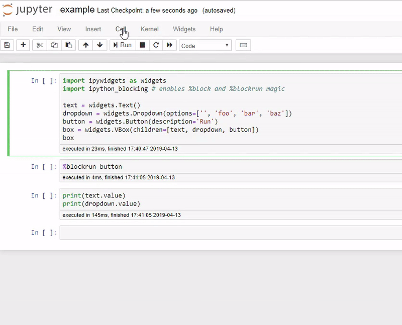

# ipython_blocking
[](https://mybinder.org/v2/gh/kafonek/ipython_blocking/master)

`ipython_blocking` is a context manager for capturing cell execution messages in a Jupyter notebook, along with magic commands `%block` and `%blockrun` for convenience.  The primary use-case for blocking notebook execution is to wait for users to interact with [ipywidgets](https://github.com/jupyter-widgets/ipywidgets) and then reference the values entered in those Widgets.


### Install
`ipython_blocking` is on [PyPI](https://pypi.org/project/ipython_blocking/), install with pip.

```python
pip install ipython_blocking
```


### Usage
Try out the demo notebooks in Binder to see `ipython_blocking` in action.  The most common way to use `ipython_blocking` is with the `%blockrun` magic and running a notebook with "cell -> run all".  `%blockrun button` stops the cell execution messages from the initial "cell -> run all", and attaches a "cell -> run all below" handler to the button so that a notebook can be run in a linear fashion without callback functions after a user has filled out other Widget values.

```python
### cell #1
import ipywidgets as widgets
import ipython_blocking # enables %block and %blockrun magic

text = widgets.Text()
dropdown = widgets.Dropdown(options=['', 'foo', 'bar', 'baz'])
button = widgets.Button(description='Run')
box = widgets.VBox(children=[text, dropdown, button])
box

### cell #2
%blockrun button

### cell #3 -- doesn't execute until the 'Run' button is pressed
### This gives the user a chance to interact with the Text and Dropdown widgets
print(text.value)
print(dropdown.value)
```

*(The dropdown menu doesn't appear in this .gif because its treated as a "separate window" in Windows screen capture, sorry!)*



#### CaptureExecution
The way `ipython_blocking` "blocks" cell execution is by creating a context manager that changes the behavior of the `IPython.shell.kernel['execute_request']` handler.  When you execute a cell in a Jupyter notebook, it sends a `execute_request` comms message to the kernel with that code.  

While the `CaptureExecution` manager is "blocking", it stores those messages in a list instead of actually executing them.  When the context manager exits, it resets the handler to its original behavior and then either replays the stored messages or drops them.

```python
import ipython_blocking
ctx = ipython_blocking.CaptureExecution(replay=True)
with ctx:
    while True:
        if break_function():
            break
        ctx.step() # handles all other messages that aren't 'execute_request' including widget value changes
```

#### %block
The `%block` magic is enabled upon importing `ipython_blocking`.  It takes either a function or widget object and creates the `CaptureExecution` manager to block until that function returns True or the widget value changes.

```python
# cell 1
import ipywidgets as widgets
import ipython_blocking
dd = widgets.Dropdown(options=['', 'foo', 'bar', baz'])
dd

# cell 2
%block dd

# cell 3
# Won't actually be executed until the user chooses an option in the dd widget
print(dd.value)
```

#### %blockrun
The `%blockrun` magic is similar to `%block` but it only accepts an `ipywidgets.Button` target and it attaches a "cell -> run all below" handler to the button.  If you expect the application logic of your Notebook to be run more than once (and/or don't want to reinitialize the Widgets because the user might only change one of many options), then `%blockrun` is the better magic to use.

It is often handy to make the target `Button` unclickable when the Notebook first renders, then add `.observe` handlers on other Widgets that can make the `Button` clickable once some input validation has happened.

```python
# cell 1
import ipywidgets as widgets
import ipython_blocking
text = widgets.Text()
dd = widgets.Dropdown(options=['', 'foo', 'bar', 'baz'])
button = widgets.Button(description='Run', disabled=True)

def validation(ev):
    "make button clickable if user has put in more than 5 characters and chosen a dropdown option"
    if len(text.value) > 5 and dd.value:
        button.disabled = False
    else:
        button.disabled = True
text.observe(validation)
dd.observe(validation)

box = widgets.VBox(children=[text, dd, button])
box

# cell 2
%blockrun button

# cell 3
print(text.value)
print(dd.value)
```
    

### Alternatives
The other ways to get the value of a widget after a user has interacted with the widget is to structure your notebook with [event callbacks](https://ipywidgets.readthedocs.io/en/latest/examples/Widget%20Events.html) or to write your code [asynchronously](https://ipywidgets.readthedocs.io/en/latest/examples/Widget%20Asynchronous.html).  

I believe there are major benefits to writing the **application logic** of a Jupyter Notebook in a **linear and synchronous** fashion, with as many variables as possible in the notebook global scope.  Those benefits include:
 
 * Better introspection and comprehension of the workflow (without littering your code with `global` and `print` statements)
 * More direct debug when something goes wrong
 * Easier to break code into small blocks/cells
 


