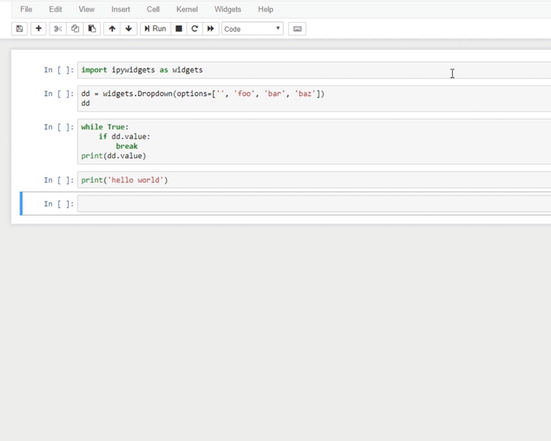
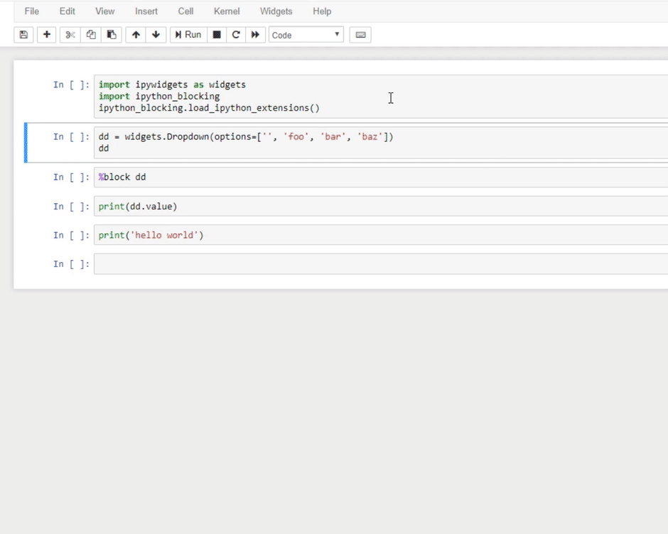
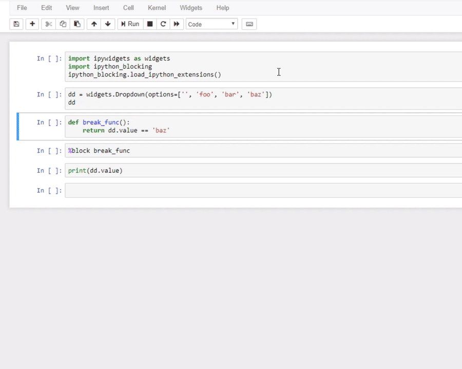

# ipython_blocking
A Python library that offers a context manager to turn on cell execution capture/blocking in Jupyter notebooks/IPykernel.  Useful when you need a "blocking widget".

# Use-case
The intended use-case of this library was to handle "blocking" until a widget value changed or was filled out to satisfy some validation function.  Widgets are often used in notebooks to offer elegant and robust form input for queries to remote API's or other complex query inputs.  Unfortunately, it's typical that the rest of the code in a "widget-based notebook" ends up being created as callbacks and is forced into a style that is hard to read, hard to debug, and hard to manipulate.

`ipython_blocking` offers a way to capture cell execution requests and then replay them after a condition is met, such as a widget changing value or other validation function is met.  That effectively "blocks" a notebook so that you can write regular non-callback code that expects to access a widget's value directly and will only run after an appropriate value is set.

# Examples
See [the demo notebook](demo_notebook.ipynb) for an interactive example.  The following gifs demonstrate the problem and the proposed solution in the `ipython_blocking` package.

### The problem

### Solution -- magic for widget change
If the argument in the `%block` line magic is a Widget instance, then the cell execution capture contex will stop when that widget has changed value.

### Solution -- magic for an arbitrary break function
If the argument in the `%block` line magic is a function or class method, then the cell execution capture context will stop when that function or method evaluates to True.  

